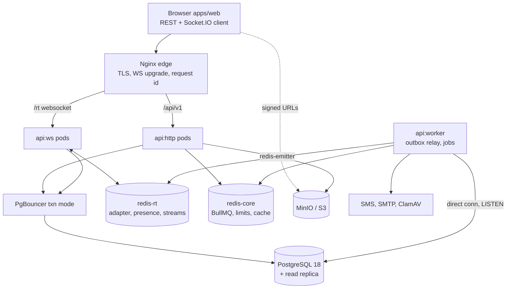
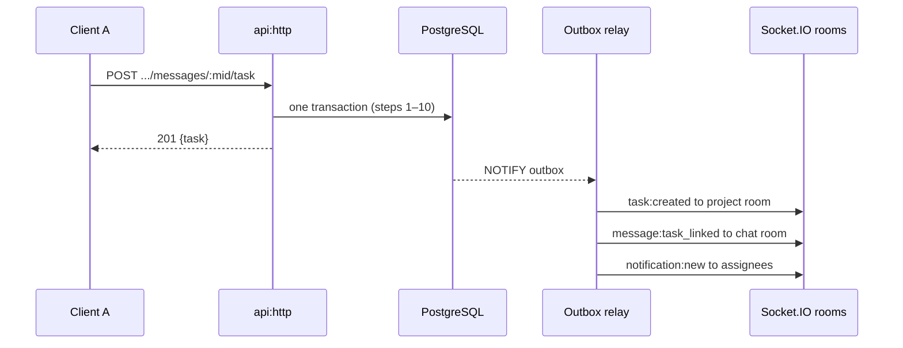

# RFC 0001 — Taskin Backend Architecture

Status: **Accepted** (2026-09-25) · Authored 2026-09-24

Taskin's backend is a NestJS modular monolith on PostgreSQL 18 (Drizzle ORM), two Redis roles and Socket.IO with the Redis adapter. It is Iran-hosted, uses mobile-OTP identity and is delivered in five milestones (M0–M4), each gated by an acceptance checklist.

## 1. Decisions and stack

The backend replaces the frontend's in-memory reducer and fixtures (`apps/web/src/store/workspace-reducer.ts`, about 60 actions) with a multi-tenant service. The four business decisions below are confirmed.

| Topic | Decision | Consequence |
| --- | --- | --- |
| Repository | Monorepo in `taskin`: `apps/web`, `apps/api`, `packages/contracts` (npm workspaces) | One CI; client and server types cannot drift; the web app moves under `apps/web` unchanged |
| Identity | Mobile OTP first. The phone number is the account; email is optional. Passwords only for owners and admins, as a step-up factor | Login becomes phone → OTP. Admin-sensitive actions need OTP session + password. SIM-swap risk is contained to non-admin accounts |
| Hosting | Iran-hosted, everything self-hosted | MinIO or Arvan/Ceph S3; Kavenegar or SMS.ir behind an adapter; self-hosted SMTP; Grafana, Loki, Tempo, Prometheus and GlitchTip; an image-registry mirror; no foreign SaaS |
| Billing | Plans and limits only | Tiers with entitlements (seats, storage, file size, history, projects). Payments come later on the same idempotency and outbox framework |

### Locked stack

| Layer | Choice |
| --- | --- |
| Runtime | Node.js 22 LTS |
| Framework | NestJS (latest stable) with strict TypeScript and `noUncheckedIndexedAccess` |
| Database | PostgreSQL 18 (native `uuidv7()`), extensions `pg_trgm`, `btree_gin`, `citext`; PgBouncer in transaction mode |
| Redis | Redis 7.4+ or Valkey 8, split into two deployments (section 3); BullMQ for queues |
| Real-time | `@nestjs/websockets` + `@nestjs/platform-socket.io` + Socket.IO 4 + `@socket.io/redis-adapter`; workers use `@socket.io/redis-emitter` |
| Object storage | MinIO or any S3-compatible store via `@aws-sdk/client-s3` and the presigners. Confirm MinIO licensing and distribution at procurement; the storage port keeps us vendor-neutral |
| Auth | `jose` (EdDSA JWT), `argon2` (argon2id), `libphonenumber-js` |
| Authorization | `@casl/ability` 6 |
| Observability | `nestjs-pino`, `nestjs-cls`, OpenTelemetry Node SDK, `prom-client`, `@nestjs/terminus` |
| Security | `helmet`, `@nestjs/throttler` with Redis storage, `class-validator` and `class-transformer` |

### ORM: Drizzle, not Prisma

Drizzle ORM on `pg` (node-postgres) wins on the two requirements that matter most here: row-level security per transaction and indexes the schema must express.

| What this system needs | Prisma | Drizzle | Winner |
| --- | --- | --- | --- |
| RLS tenant context: `SET LOCAL app.workspace_id` at the start of every transaction | Interactive `$transaction` or client-extension wrappers on every call path | `db.transaction(async tx => ...)` with one `set_config` call; explicit and uniform | Drizzle |
| Partial unique indexes, GIN trigram on generated columns, `btree_gin` composites, CHECK constraints, composite FKs | Several can't be written in the Prisma schema; they live in hand-edited SQL that drifts from the model | Expressed in the TS schema; `drizzle-kit` generates them | Drizzle |
| Chat hot path: one-round-trip CTE (seq bump, insert, cursor update, outbox) | `$queryRaw`, which loses typing | Typed builder or `sql` template with inferred result types | Drizzle |
| Seeing the emitted SQL for N+1 audits and `EXPLAIN` | Engine-generated, less control | 1:1 with the code; relational queries compile to one statement with JSON aggregation | Drizzle |
| Migration tooling (shadow DB, drift detection) | Excellent | Good, with the gaps mitigated below | Prisma |
| Hiring familiarity | Higher | Growing | Prisma |

Mitigations for the weaker migration tooling:

1. Migrations are generated SQL files, committed and code-reviewed.
2. CI runs `drizzle-kit check`, applies every migration to a fresh PostgreSQL 18 in Testcontainers and diffs `pg_dump --schema-only` against a committed snapshot.
3. Every breaking change follows expand → migrate → contract.

The brief's `$transaction` maps to our `UnitOfWork.run(fn)`, which wraps `db.transaction`.

## 2. Code architecture

The API is one NestJS image with strict module boundaries, sharing a contracts package with the web app so types cannot drift.

### Monorepo layout

```text
taskin/
├─ apps/
│  ├─ web/            # existing Next.js app, moved with git mv; no behaviour change in M0
│  └─ api/            # NestJS modular monolith: one image, three runtime roles
├─ packages/
│  ├─ contracts/      # pure TS: domain types (from web src/types), DTO interfaces,
│  │                  #   WS event map, error codes, enums, permission vocabulary
│  ├─ jalali/         # from web src/lib/jalali.ts (Intl-free, verified 1990–2035)
│  └─ text/           # Persian normalisation: toLatinDigits, normaliseIranMobile,
│                     #   search normaliser, monogram, checklist parser
├─ infra/             # docker-compose, postgres init SQL, pgbouncer, minio, nginx, otel, grafana
└─ docs/rfc/0001-backend-architecture.md
```

Contract rule: `packages/contracts` exports interfaces and string-literal unions only. API DTO classes (class-validator) `implements` them, so drift is a compile error on either side. OpenAPI is generated from the DTOs with `@nestjs/swagger`, and one typed `ServerToClientEvents` / `ClientToServerEvents` map is shared with the web `socket.io-client`.

### Bounded contexts (`apps/api/src/modules/*`)

| Module | Owns | Public facade |
| --- | --- | --- |
| `platform` | config, DB and UnitOfWork, Redis, logging, telemetry, idempotency, outbox, storage, SMS, mail, clock | infrastructure ports |
| `auth` | OTP challenges, sessions, refresh tokens, JWT, step-up, admin password, optional TOTP | `AuthFacade` |
| `users` | global profile, phone and email change | `UsersFacade` |
| `workspaces` | workspaces, members, departments, invitations, plans and entitlements | `WorkspacesFacade`, `EntitlementsService` |
| `rbac` | roles, permission matrix, CASL ability factory, guards, policy decorators | `AbilityFactory`, `@CheckPolicies` |
| `projects` | projects, project members, workflows, board columns, stars | `ProjectsFacade` |
| `tasks` | tasks, assignees, subtasks, comments, labels, attachment links, positions | `TasksFacade` |
| `chats` | conversations, members, messages, reactions, mentions, read cursors, realtime gateway | `ChatFacade`, `RealtimePublisher` |
| `files` | attachments, upload and download, scanning, quota | `FilesFacade` |
| `calendar` | events, attendees, reminders, derived deadline feed | `CalendarFacade` |
| `notes` | note categories, notes | `NotesFacade` |
| `notifications` | in-app notifications, activity feed, SMS and email delivery | `NotificationsFacade` |
| `search` | cross-entity trigram search | `SearchFacade` |
| `audit-logs` | append-only audit trail and query API | `AuditWriter` |
| `bridges` | Chat→Task, Note→Task and project↔channel orchestration; depends on facades only, so there are no cycles | none |

### Layering inside a module

- `domain/`: aggregate roots with invariants, value objects (`TaskCode`, `Placement`, `FractionalPosition`, `IranMobile`), domain events, repository ports.
- `application/`: one use case per class, DTOs in and out, depends only on ports.
- `infrastructure/`: Drizzle repositories, read-model SQL, mappers, external adapters.
- `interface/`: HTTP controllers, WS handlers, class-validator DTOs, presenters.

Rules:

- CQRS-lite: commands load and save aggregates; lists and boards use hand-written read-model SQL, never aggregate hydration. This is how we guarantee no N+1.
- Boundaries are enforced with `eslint-plugin-boundaries` or dependency-cruiser. A module imports another only through its `index.ts` facade.
- Synchronous cross-module calls go through facades inside the caller's UnitOfWork when atomicity is required (the bridge). Everything else goes through outbox domain events.

### Runtime roles (same image, `APP_ROLE`)

| Role | Runs | Scales on |
| --- | --- | --- |
| `http` | REST API, no Socket.IO server | RPS and latency |
| `ws` | Socket.IO gateway plus health endpoints | open sockets |
| `worker` | BullMQ consumers, outbox relay (single leader), schedulers, purge and GC, link unfurl, AV scan, thumbnails | queue depth |
| `all` | everything, for local development only | n/a |

Splitting `ws` from `http` gives chat its own processes and its own PgBouncer pool, so chat bursts cannot starve task workflows.

## 3. System topology

REST and WebSocket traffic run on separate process pools that share one PostgreSQL primary; Redis carries fan-out, queues and ephemeral state; files go straight between the browser and object storage on signed URLs.



Observability is fully self-hosted: pino JSON → Vector → Loki; OpenTelemetry → Collector → Tempo; prom-client → Prometheus → Grafana; errors → GlitchTip.

### HTTP request pipeline

1. Nginx forwards or generates `X-Request-Id` and W3C `traceparent`.
2. `nestjs-cls` opens the request context (`requestId`, `traceId`, `ip`, `userAgent`); `nestjs-pino` binds the logger to it.
3. Guards and pipes, in order: `ThrottlerGuard` (Redis) → `JwtAuthGuard` (unless `@Public()`) → `WorkspaceMemberGuard` on `/v1/workspaces/:workspaceId/**` → `StepUpGuard` → `PoliciesGuard` → `ValidationPipe` (`whitelist`, `forbidNonWhitelisted`, `transform`).
4. `IdempotencyInterceptor` on routes marked `@Idempotent()`.
5. The controller calls one use case, which opens one UnitOfWork: `BEGIN`, `SET LOCAL app.workspace_id / app.user_id / app.request_id`, repository work, outbox and audit inserts, `COMMIT`.
6. Errors map to RFC 9457 `application/problem+json` with `{type, title, status, code, detail, requestId, errors[]}`; the client localises by `code`.

### Redis roles

| Deployment | Policy | Holds |
| --- | --- | --- |
| `redis-rt` | no AOF, `volatile-lru` | adapter pub/sub, `presence:*`, `typing:*`, `rt:events:{wid}` streams, `ws:node:{id}` heartbeats |
| `redis-core` | AOF every second, `noeviction` (BullMQ requires it) | BullMQ queues, `throttle:*`, `idem:*`, `otp:*` counters, `revoked:sid:*`, membership and RBAC caches, leader locks |

The two policies conflict, so production keeps them separate. When Redis is down, auth, OTP and idempotency fail closed (503), read caches fall back to the DB, and clients fall back to 15-second HTTP polling until WebSocket fan-out returns.

### Presence

- Manual status (`online`, `busy`, `away`) and the status line live in `workspace_members`; connectivity lives in Redis.
- On connect the node adds `{nodeId}:{socketId}` to `presence:conn:{uid}` and refreshes its own 30-second heartbeat key.
- A user is offline when their connection set is empty. Offline is announced after a 10-second grace, which absorbs reconnect flaps.
- A leader-only sweeper removes the entries of nodes whose heartbeat expired, so a crashed node leaves no ghosts.
- Changes go to `workspace_{wid}` rooms, batched every 2 seconds.

### Transactional outbox

- Every write transaction inserts `outbox_events`; an insert trigger calls `pg_notify('outbox', id)`.
- One relay leader (`pg_try_advisory_lock`) preserves per-aggregate order. It connects directly to Postgres, not through PgBouncer, because `LISTEN` needs a session.
- It reads `WHERE published_at IS NULL ORDER BY id LIMIT 500 FOR UPDATE SKIP LOCKED`, emits realtime events (redis-emitter plus `XADD rt:events:{wid}`), enqueues BullMQ side-effect jobs, then marks the rows published.
- Delivery is at-least-once, so every consumer dedupes by event id.
- Chat exception: after commit the `ws` node emits `message:new` directly for sub-10 ms latency. The outbox carries only durable side effects (notifications, mentions, search, unfurl), and a lost direct emit is repaired by sequence-gap sync.
- `outbox_oldest_unpublished_seconds` alerts above 5 seconds.

## 4. WebSocket lifecycle

Sockets authenticate at the handshake, refresh their token in-band, join scoped rooms per workspace and recover missed events by sequence number, because the classic Redis adapter has no connection-state recovery.

### Transport

- WebSocket transport only in production, so no sticky sessions are needed. A polling fallback sits behind a flag and would require cookie stickiness at the edge.
- `pingInterval` 25 s, `pingTimeout` 20 s (mobile-carrier NAT idle timeouts); Nginx `proxy_read_timeout` 75 s; `maxHttpBufferSize` 64 KB. Files never travel over the socket.
- One namespace, `/rt`, with typed event maps. `RedisIoAdapter extends IoAdapter` uses `createAdapter` on standalone Redis and `createShardedAdapter` on Redis Cluster. Workers emit through `@socket.io/redis-emitter` and never hold sockets.

### Connection sequence

1. The client connects with `auth: { token, resume? }`. The token never goes in the query string, because query strings reach logs.
2. Handshake middleware in the adapter's `createIOServer` (Nest guards only run per message) verifies the EdDSA JWT (`kid` rotation, 30 s leeway), checks `revoked:sid:{sid}` with a DB fallback and sets `socket.data = { userId, sid, exp, connId }`. Failure returns `connect_error` with `AUTH_EXPIRED`, `AUTH_INVALID` or `SESSION_REVOKED`.
3. The socket joins `user_{userId}` and `session_{sid}`.
4. Before expiry the client refreshes over HTTP and emits `auth:refresh {token}`. Without a refresh within 60 s of `exp`, the server disconnects with `token_expired` and the client reconnects.
5. Every `@SubscribeMessage` runs `WsJwtGuard` (in-memory `exp` and revocation check) and `WsThrottlerGuard` (per-socket token bucket).
6. `workspace:subscribe {workspaceId}` loads membership and joins `workspace_{wid}`, one `project_{pid}` per viewable project and one `room_{cid}` per conversation membership.
7. Only one workspace is hot per socket; switching leaves the old rooms. `user_{id}` still delivers notifications from every workspace, each tagged with `workspaceId`.

| Room | Carries |
| --- | --- |
| `user_{userId}` | notifications, permission updates, workspace removal |
| `session_{sid}` | forced disconnect on logout or revocation |
| `workspace_{wid}` | members, presence, workspace settings |
| `project_{pid}` | board and task events |
| `room_{conversationId}` | messages, reactions, typing, read cursors |

Membership changes propagate cluster-wide through the adapter: `io.in('user_{uid}').socketsJoin('room_{cid}')` or `socketsLeave(...)`, `io.in('session_{sid}').disconnectSockets(true)` on revocation, and `socketsLeave('workspace_{wid}')` plus `workspace:removed` when a member is removed or a workspace deleted.

### Reconnection and gap recovery

- Chat: every conversation has a monotonic `seq`. On reconnect the client sends `sync:resume { workspaceId, conversations: {cid: lastSeq}[], lastEventId }`. The server returns messages with `seq > lastSeq` (up to 200 per conversation) or `{ gap: true }`, and the client then refetches the latest page over HTTP.
- Everything else: each event's `eventId` is a Redis Stream entry in `rt:events:{workspaceId}` (`MAXLEN ~ 20000`, about 24 hours). Resume replays with `XRANGE`, filtered per socket by current permissions. A trimmed `lastEventId` yields `resync:required {scopes}` and the client invalidates those query keys.
- Events carry entity ids and a `version`; the client applies an update only when the version is newer than its cache.

### Typing, delivery and read receipts

- `typing:start` / `typing:stop` are volatile emits to `room_{cid}`. The client throttles to one per 3 s, the server caps at 1/s per socket and auto-stops after 6 s. Nothing is persisted.
- The `message:send` ack means persisted (✓). `message:delivered` and `message:read {cid, seq}` advance per-member cursors (`last_delivered_seq`, `last_read_seq`) rather than per-message rows, which avoids write amplification.
- `read:updated {cid, userId, seq}` is coalesced over 1-second windows. The frontend's `readByIds` becomes `member.last_read_seq >= message.seq`; channels above 50 members show a count instead of names.

## 5. Data access and operations

One transaction per use case at READ COMMITTED, explicit row locks in a fixed order, keyset pagination and a per-request SQL budget keep the database predictable under load.

### Pooling and transactions

- PgBouncer in transaction mode with per-role pools: about 20 connections per `http` pod, 10 per `ws` pod, 10 per worker; PostgreSQL `max_connections` 200 behind it. Only `SET LOCAL` and unnamed statements are used; PgBouncer 1.21+ with `max_prepared_statements` if named statements ever appear.
- Lock order is canonical, which prevents deadlocks: workspace → project or workflow → conversation → column → task → subtask. Invariants take `SELECT ... FOR UPDATE` on the aggregate root: the project row for task numbering, the workflow row for column changes, the conversation row for `seq`.
- SQLSTATE `40001`, `40P01` and `55P03` are retried up to 3 times with jittered backoff. This is safe because the whole use case is one transaction and idempotent.
- No network I/O inside a transaction: SMS, email, S3 and HTTP calls all go through the outbox.

### No N+1, by construction

- Every list or board endpoint is one read-model query (joins, `json_agg` for children, lateral joins for last message) or a fixed number of batched `= ANY($1)` queries.
- An integration-test harness counts SQL statements per request and asserts budgets, for example board load ≤ 3 and conversation list ≤ 2.
- Pagination is keyset only with opaque cursors: `(created_at, id)` for most lists, `seq` for messages. No `OFFSET`.
- Tasks, notes and columns carry `version int`; updates take `If-Match: "<version>"` and a mismatch returns `412` with the current state. Board moves carry `expectedVersion`.

### Observability

- Pino JSON lines carry `requestId`, `traceId`, `spanId`, `userId`, `workspaceId`, `sessionId`, `route`, `latencyMs` and `statusCode`. WS handlers run each event in `cls.run` with `connId`, `event` and the client's `meta.requestId`.
- Redaction: `authorization`, `cookie`, `set-cookie`, `*.password`, `*.otp`, `*.code`, `*.token`, `refreshToken`; `phone` is masked to `+98912***4567`.
- OpenTelemetry auto-instruments `http`, `pg`, `ioredis` and `socket.io`. Trace context rides in outbox `headers` and BullMQ job data, so worker spans link to the originating request.
- Metrics: RED per route, WS connections per node, messages per second, fan-out latency histogram, outbox lag, queue depth, PgBouncer wait time, OTP success rate per provider.
- `/health/live` checks the process; `/health/ready` checks the DB, both Redis instances, S3 and, on workers, the queue connection.
- Graceful shutdown: `ws` nodes emit `server:draining` and clients reconnect with 0–5 s jitter; `http` stops accepting and drains; workers finish or return jobs.

### Security baseline

- Helmet with CSP `default-src 'none'` and `frame-ancestors 'none'` (the API is JSON-only). Strict CORS allowlist from env; in production web and API share `app.taskin.ir` with `/api`, so browsers never need CORS.
- JSON body limit 1 MB; `ParseUUIDPipe` on every id.
- CSRF: Bearer tokens are immune. The only cookie-authenticated routes, `/auth/refresh` and `/auth/logout`, use a `SameSite=Strict` `__Host-` cookie, an `Origin` allowlist check and a double-submit `X-CSRF-Token` (the deprecated `csurf` is not used).
- Secrets in SOPS-encrypted env files or self-hosted Vault. JWT signing keys carry a `kid` and rotate every 90 days, keeping the previous key for verification.
- Backups: pgBackRest (weekly full, daily differential, WAL archiving) for RPO ≤ 5 min and RTO ≤ 1 h; MinIO versioning plus site replication; a restore drill every milestone from M2.

| Rate limit (Redis store) | Limit |
| --- | --- |
| Global, per IP | 300/min |
| Per user | 600/min |
| OTP send | 1 per 60 s and 5/h per phone; 20/h per IP |
| OTP verify | 5 attempts per challenge; 30/h per IP |
| Upload init | 60/h per user |
| WS `message:send` | burst 20, then 5/s per socket |

### Migrations

- `drizzle-kit generate` produces SQL; each file is reviewed and may be hand-edited for policies, triggers and `CONCURRENTLY` index builds (run as separate non-transactional migrations).
- A `migrate` job applies them as `taskin_migrator`, the table owner. The app runs as `taskin_app`: DML only, `FORCE ROW LEVEL SECURITY`, and no `UPDATE` or `DELETE` on `audit_logs`.
- Expand → migrate → contract: add nullable columns or tables, backfill in batched jobs, switch reads, drop in a later release.
- Seeds are idempotent upserts: plans, role templates from `DEFAULT_PERMISSION_MATRIX` (`apps/web/src/data/reference.ts`), built-in note categories, the default four columns and default departments. A dev seed ports today's fixtures so the UI looks the same against the real API.

## 6. Schema I: conventions, identity, tenancy, RBAC

Every tenant table carries `workspace_id`, a composite foreign key and a row-level security policy that fails closed, so a cross-tenant read or write is impossible even if application code is wrong.

### Conventions

- Primary keys: `id uuid PRIMARY KEY DEFAULT uuidv7()` (time-ordered, index-friendly, safe to expose). Task codes such as `CRM-104` are separate human keys.
- Instants are `timestamptz` in UTC; calendar-date semantics (due and start dates, all-day events) are `date`. Every table has `created_at` and a trigger-maintained `updated_at`; `deleted_at` only where recovery or tombstones matter.
- Tenant tables have `workspace_id uuid NOT NULL` and `UNIQUE (workspace_id, id)`. Child FKs are composite, `(workspace_id, parent_id) REFERENCES parent (workspace_id, id)`.
- Enum literals equal the `packages/contracts` literals exactly (for example `'in-progress'`), so there is no mapping layer.
- Persian search: a `search_text` column holds text normalised by `packages/text` (ي→ی, ك→ک, tatweel and diacritics removed, ZWNJ unified, Persian and Arabic digits to ASCII, Latin lower-cased), indexed `GIN (workspace_id, search_text gin_trgm_ops)` via `btree_gin`. PostgreSQL has no Persian stemmer; trigrams handle Persian morphology acceptably.

```sql
-- applied to every tenant table
ALTER TABLE t ENABLE ROW LEVEL SECURITY;
ALTER TABLE t FORCE ROW LEVEL SECURITY;
CREATE POLICY tenant_isolation ON t
  USING      (workspace_id = current_setting('app.workspace_id', true)::uuid)
  WITH CHECK (workspace_id = current_setting('app.workspace_id', true)::uuid);
-- no setting → NULL → false → zero rows (fails closed)
```

### Enum types

```text
user_status            active | suspended | deleted
otp_purpose            login | step_up | phone_change
session_revoke_reason  logout | user_revoked | reuse_detected | password_changed | admin_action | expired | workspace_removed
member_status          active | suspended | left
presence_status        online | busy | away            (offline is derived, never stored)
avatar_tone            brand | teal | violet | amber | rose | slate
tag_tone               gray | blue | teal | green | amber | red | pink | violet
invitation_channel     email | sms
invitation_status      pending | accepted | revoked | expired
permission_module      messages | boards | files | reports | members
permission_action      view | create | edit | delete | assign
project_role           lead | contributor | viewer
project_visibility     workspace | private
task_status            todo | in-progress | review | done
task_priority          urgent | high | medium | low
conversation_kind      direct | group | channel
conversation_role      owner | admin | member
post_policy            everyone | admins
membership_mode        manual | project_synced
notification_level     all | mentions | none
message_kind           text | voice | file | system
attachment_kind        image | video | document | sheet | archive | audio
attachment_status      pending | scanning | ready | rejected | deleted
event_kind             meeting | reminder | milestone
attendee_response      pending | accepted | declined | tentative
notification_kind      task_assigned | status_changed | comment | mention | reply | invitation | event_reminder | member_joined
activity_kind          task_assigned | task_completed | task_commented | message_mention | file_shared | member_joined
```

### Identity and auth (global, no RLS; reached only through service methods keyed by `sub`)

```sql
users (
  id uuid PK, phone_e164 text NOT NULL,          -- '+989121234567'
  phone_verified_at timestamptz NOT NULL,
  email citext NULL, email_verified_at timestamptz NULL,
  full_name text NOT NULL CHECK (char_length(full_name) BETWEEN 2 AND 80),
  avatar_key text NULL, avatar_tone avatar_tone NOT NULL DEFAULT 'brand',
  locale text NOT NULL DEFAULT 'fa-IR', time_zone text NOT NULL DEFAULT 'Asia/Tehran',
  password_hash text NULL,                        -- argon2id; required once owner/admin anywhere
  password_changed_at timestamptz NULL,
  failed_password_attempts int NOT NULL DEFAULT 0, locked_until timestamptz NULL,
  totp_secret_enc bytea NULL,                     -- optional second factor, AES-GCM
  security_version int NOT NULL DEFAULT 1,        -- bump = invalidate every session
  status user_status NOT NULL DEFAULT 'active',
  created_at, updated_at, deleted_at timestamptz NULL
)
UNIQUE (phone_e164) WHERE deleted_at IS NULL
UNIQUE (email) WHERE email IS NOT NULL AND deleted_at IS NULL

otp_challenges (
  id uuid PK, phone_e164 text NOT NULL, purpose otp_purpose NOT NULL,
  code_hash bytea NOT NULL,                       -- HMAC-SHA256(pepper, code || id); 6 digits, 120 s TTL
  attempts smallint NOT NULL DEFAULT 0 CHECK (attempts <= 5),
  provider text NOT NULL, provider_message_id text NULL, ip inet NOT NULL, user_agent text NULL,
  expires_at timestamptz NOT NULL, consumed_at timestamptz NULL, created_at
)
INDEX (phone_e164, purpose, created_at DESC)       -- purged after 24 h

auth_sessions (                                    -- one per device login ("نشست‌های فعال")
  id uuid PK /* = JWT sid */, user_id uuid NOT NULL REFERENCES users ON DELETE CASCADE,
  device_label text, user_agent text, ip inet, geo_city text,   -- local GeoIP database
  amr text[] NOT NULL,                            -- {otp} | {otp,pwd} | {otp,totp}
  created_at, last_active_at timestamptz NOT NULL,
  idle_expires_at timestamptz NOT NULL,           -- sliding 30 days
  absolute_expires_at timestamptz NOT NULL,       -- hard cap 90 days
  revoked_at timestamptz NULL, revoke_reason session_revoke_reason NULL
)
INDEX (user_id) WHERE revoked_at IS NULL

refresh_tokens (                                   -- rotation with reuse detection
  id uuid PK, session_id uuid NOT NULL REFERENCES auth_sessions ON DELETE CASCADE,
  token_hash bytea NOT NULL UNIQUE,               -- sha256 of a 256-bit opaque token
  issued_at, expires_at timestamptz NOT NULL, used_at timestamptz NULL,
  replaced_by uuid NULL REFERENCES refresh_tokens
)
INDEX (session_id)
```

### Tenancy, members and invitations

```sql
plans (id text PK /* free | team | enterprise */, name text, limits jsonb NOT NULL, created_at)
  -- limits: {max_members, storage_bytes, max_file_bytes, message_history_days, max_projects}

workspaces (
  id uuid PK, slug citext NOT NULL UNIQUE,
  name text NOT NULL CHECK (char_length(name) BETWEEN 1 AND 40),
  description text NOT NULL DEFAULT '' CHECK (char_length(description) <= 160),
  initials text NOT NULL, tone avatar_tone NOT NULL, icon_key text NULL,
  owner_user_id uuid NOT NULL REFERENCES users ON DELETE RESTRICT,   -- source of truth for Owner
  plan_id text NOT NULL REFERENCES plans DEFAULT 'free',
  settings jsonb NOT NULL,     -- timeZone, weekStart saturday, weekend [friday],
                               -- systemMessageOnConvert, allowedEmailDomains
  member_count int NOT NULL DEFAULT 1,
  storage_used_bytes bigint NOT NULL DEFAULT 0, storage_reserved_bytes bigint NOT NULL DEFAULT 0,
  rbac_version int NOT NULL DEFAULT 1,            -- bumped on any role, matrix or membership-role change
  created_at, updated_at, deleted_at timestamptz NULL, purge_after timestamptz NULL
)

departments (id, workspace_id, name text NOT NULL, position int, created_at)
  UNIQUE (workspace_id, lower(name))

workspace_members (
  workspace_id uuid, user_id uuid REFERENCES users ON DELETE CASCADE,
  role_id uuid NOT NULL,        FK (workspace_id, role_id) → roles ON DELETE RESTRICT,
  department_id uuid NULL,      FK (workspace_id, department_id) → departments ON DELETE SET NULL,
  job_title text NOT NULL DEFAULT '', status member_status NOT NULL DEFAULT 'active',
  presence_status presence_status NOT NULL DEFAULT 'online',
  status_message text NOT NULL DEFAULT '' CHECK (char_length(status_message) <= 80),
  invited_by uuid NULL, joined_at timestamptz NOT NULL, left_at timestamptz NULL,
  PRIMARY KEY (workspace_id, user_id)
)
INDEX (user_id) WHERE status = 'active'          -- workspace switcher
-- RLS: workspace_id = app.workspace_id OR user_id = app.user_id

invitations (
  id, workspace_id, channel invitation_channel NOT NULL,
  address text NOT NULL,                          -- lower-cased email | E.164 phone
  role_id uuid NOT NULL, department_id uuid NULL, -- composite FKs
  message text NOT NULL DEFAULT '' CHECK (char_length(message) <= 280),
  token_hash bytea NOT NULL UNIQUE, status invitation_status NOT NULL DEFAULT 'pending',
  invited_by uuid NOT NULL, expires_at timestamptz NOT NULL /* +7 days */,
  accepted_by uuid NULL, accepted_at timestamptz NULL, created_at
)
UNIQUE (workspace_id, channel, address) WHERE status = 'pending'
```

### RBAC

```sql
roles (
  id, workspace_id, key text NOT NULL,            -- owner | admin | manager | member | guest (+ custom later)
  name text NOT NULL, rank smallint NOT NULL,     -- 0 = most authority
  is_system boolean NOT NULL, is_locked boolean NOT NULL,   -- owner is locked
  created_at, updated_at
)
UNIQUE (workspace_id, key)

role_permissions (                                 -- one row = one granted cell of the UI matrix
  workspace_id, role_id uuid /* composite FK, ON DELETE CASCADE */,
  module permission_module, action permission_action,
  PRIMARY KEY (role_id, module, action)
)
-- trigger rejects INSERT/DELETE for roles.is_locked (owner row immutable, as in the UI)

project_members (
  workspace_id, project_id /* composite FK, CASCADE */, user_id,
  role project_role NOT NULL, added_by, added_at,
  PRIMARY KEY (project_id, user_id)
)
INDEX (workspace_id, user_id)
-- channel-level roles live on conversation_members.role (schema III)
```

## 7. Schema II: projects, board, tasks

Columns belong to a workspace workflow (every project uses the default one in v1, matching today's single board), and a task's column is the source of truth for its status category.

```sql
projects (
  id, workspace_id, key text NOT NULL CHECK (key ~ '^[A-Z][A-Z0-9]{1,5}$'),   -- 'CRM'
  name text NOT NULL, description text NOT NULL DEFAULT '',
  department_id uuid NULL /* composite FK, SET NULL */, color avatar_tone NOT NULL,
  parent_id uuid NULL, FK (workspace_id, parent_id) → projects ON DELETE RESTRICT,   -- depth ≤ 2
  visibility project_visibility NOT NULL DEFAULT 'workspace',
  workflow_id uuid NOT NULL /* composite FK, RESTRICT */,
  task_seq bigint NOT NULL DEFAULT 0,             -- next task number (row locked)
  archived_at, created_by, created_at, updated_at, deleted_at
)
UNIQUE (workspace_id, key) WHERE deleted_at IS NULL
INDEX (workspace_id, parent_id)

project_stars (user_id, workspace_id, project_id, created_at, PRIMARY KEY (user_id, project_id))  -- stars are per user

workflows (id, workspace_id, name, is_default boolean, version int NOT NULL DEFAULT 1, created_at)
  UNIQUE (workspace_id) WHERE is_default

board_columns (
  id, workspace_id, workflow_id /* composite FK, CASCADE */,
  title text NOT NULL CHECK (char_length(title) BETWEEN 1 AND 32),
  status task_status NOT NULL,                    -- category a card takes when dropped here
  tone tag_tone NULL, is_builtin boolean NOT NULL,
  position text COLLATE "C" NOT NULL,             -- fractional index, start → end
  created_at, updated_at, deleted_at
)
UNIQUE (workflow_id, lower(title)) WHERE deleted_at IS NULL
INDEX (workflow_id, position) WHERE deleted_at IS NULL
-- invariant (service + deferred constraint trigger): every workflow keeps ≥ 1 live
-- 'todo' column and ≥ 1 live 'done' column (default placement, quick-complete)

tasks (
  id, workspace_id, project_id /* composite FK, RESTRICT */, number bigint NOT NULL,
  -- code = project.key || '-' || number
  title text NOT NULL CHECK (char_length(title) BETWEEN 1 AND 200), description text NOT NULL DEFAULT '',
  column_id uuid NOT NULL /* composite FK → board_columns, RESTRICT */,
  status task_status NOT NULL,                    -- = column.status, written in the same statement
  position text COLLATE "C" NOT NULL,             -- order within the column
  priority task_priority NOT NULL DEFAULT 'medium',
  reviewer_id uuid NULL, start_date date NOT NULL, due_date date NULL,   -- workspace-tz dates
  completed_at timestamptz NULL, reopen_column_id uuid NULL,             -- UI "reopenTo"
  source_message_id uuid NULL, FK (workspace_id, source_message_id) → messages ON DELETE SET NULL,
  source_note_id    uuid NULL, FK (workspace_id, source_note_id)    → notes    ON DELETE SET NULL,
  created_by uuid NOT NULL, version int NOT NULL DEFAULT 1, search_text text NOT NULL,
  archived_at timestamptz NULL, created_at, updated_at, deleted_at
)
UNIQUE (project_id, number)
UNIQUE (source_message_id) WHERE source_message_id IS NOT NULL AND deleted_at IS NULL   -- 1 message → ≤ 1 live task
UNIQUE (source_note_id)    WHERE source_note_id    IS NOT NULL AND deleted_at IS NULL
INDEX (workspace_id, column_id, position) WHERE deleted_at IS NULL AND archived_at IS NULL   -- board
INDEX (workspace_id, project_id, status)  WHERE deleted_at IS NULL AND archived_at IS NULL   -- list, filters
INDEX (workspace_id, due_date) WHERE deleted_at IS NULL AND archived_at IS NULL AND status <> 'done'  -- calendar, due soon
GIN   (workspace_id, search_text gin_trgm_ops)

task_assignees (workspace_id, task_id /* CASCADE */, user_id, assigned_by, assigned_at,
                PRIMARY KEY (task_id, user_id))
  INDEX (workspace_id, user_id)                   -- "وظایف من"
task_stars (user_id, workspace_id, task_id /* CASCADE */, PRIMARY KEY (user_id, task_id))
subtasks (id, workspace_id, task_id /* CASCADE */, title CHECK (1..200), done boolean,
          assignee_id NULL, position text COLLATE "C", completed_at, created_at)
  INDEX (task_id, position)
task_comments (id, workspace_id, task_id /* CASCADE */, author_id, body CHECK (1..4000),
               reply_to_id NULL /* self, SET NULL */, created_at, edited_at, deleted_at)
  INDEX (task_id, created_at)
labels (id, workspace_id, name, tone tag_tone, UNIQUE (workspace_id, lower(name)))
task_labels (workspace_id, task_id /* CASCADE */, label_id /* CASCADE */, PRIMARY KEY (task_id, label_id))
task_attachments (workspace_id, task_id /* CASCADE */, attachment_id /* RESTRICT */, added_by, added_at,
                  PRIMARY KEY (task_id, attachment_id))
task_events (id, workspace_id, task_id /* CASCADE */, actor_id, type text, payload jsonb, created_at)  -- timeline
  INDEX (task_id, created_at)
```

The message link shown in chat (`linkedTaskId`) is derived from `tasks.source_message_id` with a join, never written twice. Stars on projects and tasks are per user, unlike today's single-user fixtures.

## 8. Schema III: chat, files, calendar, notes, notifications, platform

Chat ordering comes from a per-conversation sequence and per-member cursors; files are ref-counted rows pointing at object keys; audit and outbox tables are append-only infrastructure.

### Chat

```sql
conversations (
  id, workspace_id, kind conversation_kind NOT NULL,
  title text NULL CHECK (kind = 'direct' OR title IS NOT NULL), topic text NOT NULL DEFAULT '',
  tone avatar_tone NOT NULL,
  direct_key text NULL,                           -- 'minUserId:maxUserId' for direct chats
  is_private boolean NOT NULL DEFAULT true,       -- channels may be public within the workspace
  post_policy post_policy NOT NULL DEFAULT 'everyone',   -- announcement channels = 'admins'
  project_id uuid NULL /* composite FK, SET NULL */, membership_mode membership_mode NOT NULL DEFAULT 'manual',
  last_seq bigint NOT NULL DEFAULT 0, last_message_at timestamptz NULL,
  created_by, created_at, updated_at, archived_at
)
UNIQUE (workspace_id, direct_key) WHERE kind = 'direct'      -- race-safe DM dedupe
INDEX (workspace_id, project_id) WHERE project_id IS NOT NULL
CHECK ((kind = 'direct') = (direct_key IS NOT NULL))

conversation_members (
  workspace_id, conversation_id /* CASCADE */, user_id,
  role conversation_role NOT NULL DEFAULT 'member',
  last_read_seq bigint NOT NULL DEFAULT 0, last_delivered_seq bigint NOT NULL DEFAULT 0,
  pinned_at timestamptz NULL, muted_until timestamptz NULL,   -- per-user pin and mute
  notification_level notification_level NOT NULL DEFAULT 'all',
  hidden_at timestamptz NULL, joined_at, left_at,
  PRIMARY KEY (conversation_id, user_id)
)
INDEX (workspace_id, user_id) WHERE left_at IS NULL          -- sidebar

messages (
  id, workspace_id, conversation_id, seq bigint NOT NULL,
  author_id uuid NULL,                            -- NULL for system messages
  kind message_kind NOT NULL, body_text text NULL CHECK (char_length(body_text) <= 8000),
  body_meta jsonb NULL,                           -- voice {durationSec, waveform}, system {type, params}
  attachment_id uuid NULL /* composite FK, RESTRICT */, reply_to_id uuid NULL,
  client_msg_id uuid NULL,                        -- idempotent message:send
  source_event_id bigint NULL,                    -- dedupe for outbox-generated system messages
  search_text text NULL, edited_at, deleted_at, created_at
)
UNIQUE (conversation_id, seq)
UNIQUE (conversation_id, author_id, client_msg_id) WHERE client_msg_id IS NOT NULL
UNIQUE (conversation_id, source_event_id) WHERE source_event_id IS NOT NULL
GIN (workspace_id, search_text gin_trgm_ops) WHERE deleted_at IS NULL
-- growth: PARTITION BY HASH (conversation_id) x 16 beyond ~200 M rows;
-- every unique key already leads with conversation_id

message_reactions (workspace_id, message_id /* CASCADE */, user_id,
                   emoji text CHECK (octet_length(emoji) <= 32), created_at,
                   PRIMARY KEY (message_id, user_id, emoji))
message_mentions (workspace_id, message_id /* CASCADE */, user_id, PRIMARY KEY (message_id, user_id))
  INDEX (workspace_id, user_id)
link_previews (url_hash bytea PK, url text, title, site_name, image_key NULL, status text, fetched_at)  -- global cache
```

Mentions are stored as `<@userId>` tokens in `body_text` and rendered client-side, so renaming a user never rewrites history.

### Files

```sql
attachments (
  id, workspace_id, uploader_id, bucket text,
  object_key text NOT NULL UNIQUE,                -- ws/{wid}/att/{id}
  file_name text NOT NULL,                        -- bidi controls U+202A–202E, U+2066–2069 stripped
  mime_type text NOT NULL,                        -- sniffed server-side, never trusted from the client
  kind attachment_kind NOT NULL, size_bytes bigint NOT NULL CHECK (size_bytes > 0),
  checksum_sha256 bytea NULL, status attachment_status NOT NULL DEFAULT 'pending',
  meta jsonb NULL /* width, height, durationSec, pages */, thumbnail_key text NULL,
  created_at, ready_at, deleted_at
)
INDEX (workspace_id, status, created_at)           -- GC of stale pending uploads and orphans
-- linked from messages.attachment_id and task_attachments; unlinked objects GC'd after 24 h
```

### Calendar and notes

```sql
calendar_events (
  id, workspace_id, kind event_kind NOT NULL, title CHECK (1..120), description text NOT NULL DEFAULT '',
  project_id uuid NULL /* composite FK, SET NULL */, all_day boolean NOT NULL,
  start_date date NULL, end_date date NULL,       -- all-day events and milestones
  starts_at timestamptz NULL, ends_at timestamptz NULL,   -- timed meetings and reminders
  time_zone text NOT NULL, recurrence_rule text NULL /* RRULE, v2 */,
  created_by, version int, created_at, updated_at, deleted_at,
  CHECK ((all_day AND start_date IS NOT NULL AND starts_at IS NULL) OR
         (NOT all_day AND starts_at IS NOT NULL AND (ends_at IS NULL OR ends_at > starts_at)))
)
INDEX (workspace_id, starts_at) WHERE deleted_at IS NULL
INDEX (workspace_id, start_date) WHERE deleted_at IS NULL
calendar_event_attendees (workspace_id, event_id /* CASCADE */, user_id,
                          response attendee_response DEFAULT 'pending', PRIMARY KEY (event_id, user_id))
-- task deadlines are not stored here: GET /calendar merges events with a tasks.due_date range query

note_categories (id, workspace_id, owner_id, key text NULL /* personal | work | ideas | meetings */,
                 label text NOT NULL, is_builtin boolean, position int, created_at,
                 UNIQUE (workspace_id, owner_id, lower(label)))
notes (
  id, workspace_id, owner_id, category_id uuid NOT NULL,
  FK (workspace_id, category_id) → note_categories ON DELETE RESTRICT,   -- "delete only when empty"
  title text NOT NULL DEFAULT '' CHECK (char_length(title) <= 200),
  body text NOT NULL DEFAULT '' CHECK (char_length(body) <= 100000),
  colors tag_tone[] NOT NULL DEFAULT '{}', pinned_at timestamptz NULL,
  version int NOT NULL DEFAULT 1, search_text text NOT NULL, created_at, updated_at, deleted_at
)
INDEX (workspace_id, owner_id, category_id, updated_at DESC) WHERE deleted_at IS NULL
-- RLS adds owner_id = app.user_id: notes are private in v1
```

### Notifications, activity and audit

```sql
notifications (
  id, workspace_id, recipient_id, actor_id NULL, kind notification_kind NOT NULL, payload jsonb NOT NULL,
  subject text NOT NULL,                          -- title snapshot at event time
  target_type text NOT NULL CHECK (target_type IN ('task','conversation','message','event','workspace')),
  target_id uuid NOT NULL, dedupe_key text NULL, read_at timestamptz NULL, created_at
)
INDEX (recipient_id, workspace_id, created_at DESC)
INDEX (recipient_id) WHERE read_at IS NULL          -- badge counts across workspaces
UNIQUE (recipient_id, dedupe_key) WHERE dedupe_key IS NOT NULL AND read_at IS NULL   -- storm collapse
-- RLS: recipient_id = app.user_id

activity_events (id, workspace_id, actor_id, kind activity_kind, target_type, target_id,
                 target_title, context text, project_id uuid NULL, created_at)
INDEX (workspace_id, created_at DESC)               -- filtered at read time by accessible projects

audit_logs (                                        -- taskin_app has INSERT and SELECT only
  id bigint GENERATED ALWAYS AS IDENTITY, workspace_id uuid NULL,
  actor_user_id uuid NULL, actor_session_id uuid NULL,
  action text NOT NULL,                           -- task.create | rbac.permission.grant | workspace.delete ...
  resource_type text, resource_id uuid, changes jsonb /* {before, after}, PII-redacted */,
  ip inet, user_agent text, request_id text, trace_id text,
  created_at timestamptz NOT NULL DEFAULT now()
) PARTITION BY RANGE (created_at)                  -- monthly partitions, 12-month default retention
INDEX (workspace_id, created_at DESC), (workspace_id, resource_type, resource_id)
```

### Platform

```sql
idempotency_keys (
  user_id uuid, scope text /* 'POST /v1/workspaces/:wid/tasks' */,
  key text CHECK (char_length(key) BETWEEN 8 AND 64),
  request_hash bytea NOT NULL, state text NOT NULL CHECK (state IN ('in_progress','completed')),
  response_status int NULL, response_body jsonb NULL, resource_id uuid NULL,
  created_at, expires_at timestamptz NOT NULL /* +24 h */,
  PRIMARY KEY (user_id, scope, key)
)
outbox_events (
  id bigint GENERATED ALWAYS AS IDENTITY PRIMARY KEY, workspace_id uuid NULL,
  aggregate_type text, aggregate_id uuid, event_type text /* task.created */,
  payload jsonb, headers jsonb /* traceparent, requestId, actorId */,
  created_at, published_at timestamptz NULL
)
INDEX (id) WHERE published_at IS NULL               -- relay scan; published rows purged after 7 days
```

## 9. Jalali and time

The database stores UTC instants and workspace-time-zone dates only; Jalali exists purely in presentation, in both the web app and server-generated text.

| Kind of value | Stored as | On the wire |
| --- | --- | --- |
| Instants: `sent_at`, `created_at`, timed events | `timestamptz` (UTC) | ISO-8601 with `Z` |
| Calendar dates: due and start dates, all-day events, milestones | `date` in the workspace time zone (default `Asia/Tehran`) | `YYYY-MM-DD` |
| Jalali strings | never stored | never sent; ASCII digits only |

- Storing dates as `date` avoids the 00:00–03:30 Tehran window where the UTC date differs, and matches the frontend's local-date parsing (`fromISODate`).
- Any Persian or Arabic digits in input are normalised by `packages/text` before validation.
- Server-side Jalali (notification and SMS copy such as "مهلت فردا", reports by Jalali month or week, exports) uses `packages/jalali`, the same implementation the web app already verified day by day for 1990–2035. Jalali ranges are converted to Gregorian `date` ranges before querying.
- Weeks start on Saturday and the weekend is Friday, both from workspace settings.
- "Today", overdue and due-soon are computed in the workspace zone with `Intl.DateTimeFormat(..., { timeZone })`. We rely on the IANA zone rather than a fixed offset: Iran no longer observes DST (abolished 2022), but older rows predate that.
- Reminders are BullMQ delayed jobs at the computed UTC instant, with job id `event:{id}:v{version}`; editing an event reschedules and the stale job no-ops on its version check.
- Leap years (Esfand 30) are covered by the existing `packages/jalali` test corpus.

## 10. Chat-to-Task bridge

"تبدیل پیام به وظیفه" is one idempotent transaction that creates the task, links the message and writes outbox events; everything visible to other users happens after commit.

### Endpoint and authorisation

`POST /v1/workspaces/:wid/conversations/:cid/messages/:mid/task` with an `Idempotency-Key` header. The body is the contracts `TaskDraft` the UI already builds in `ChatView.buildDraft`: title, description, projectId, columnId, priority, assigneeIds, dueDate, attachmentIds.

All of these must pass:

1. The actor is a member of the workspace (guard).
2. The actor can view the source message: member of the conversation, message not deleted.
3. The actor can create tasks in the target project.
4. Every attachment id belongs to this message; anything else is an IDOR attempt and returns 422.
5. Every assignee can view the target project; otherwise 422 `ASSIGNEE_NO_ACCESS`.

### Transaction

```text
1  INSERT idempotency_keys (in_progress)       conflict → replay / 409 in progress / 422 hash mismatch
2  SELECT message FOR SHARE                     gone → 410 SOURCE_MESSAGE_GONE
3  UPDATE projects SET task_seq = task_seq + 1  archived → 409 PROJECT_ARCHIVED
     WHERE id = $pid AND archived_at IS NULL RETURNING task_seq, key, workflow_id
4  resolve column (same workflow; default first 'todo') and a fractional position at the top
5  INSERT tasks (source_message_id = $mid)
     ON CONFLICT (source_message_id) DO NOTHING → no row: return existing task, 200 {existing: true}
6  INSERT task_assignees, task_attachments (links existing rows; no byte copy)
7  if settings.systemMessageOnConvert and not a DM:
     bump conversations.last_seq, INSERT system message {type: message_converted, taskId, code}
8  INSERT task_events, activity_events, audit_logs (task.create_from_message)
9  INSERT outbox_events: task.created, message.task_linked, notification.requested
10 UPDATE idempotency_keys (completed, response); COMMIT
```

### After commit



| Target | Event | Why |
| --- | --- | --- |
| `project_{pid}` | `task:created` (full card) | boards and lists of project viewers update |
| `room_{cid}` | `message:task_linked {messageId, taskId, code}` | every chat member sees "مشاهده وظیفه مرتبط". The payload omits title and description because not every chat member can see the project; `GET /tasks/:id/preview` enforces access |
| `room_{cid}` | `message:new` (system message) | traceability in the conversation |
| `user_{assignee}` | `notification:new` | written by the notifications worker with per-user preferences |
| BullMQ | `search.index`, `activity.fanout` | asynchronous side effects |

The originating client receives `201 {task}` and then `task:created`, and dedupes by id and version.

### Edge cases

| Case | Outcome |
| --- | --- |
| Message deleted between opening the composer and submitting | 410 `SOURCE_MESSAGE_GONE` |
| Actor removed from the conversation meanwhile | 403 |
| Two devices convert the same message | Partial unique index: the second gets 200 `{existing: true}` |
| Conversion from a direct message | Allowed as an explicit act, audited, no system message |
| Message edited after conversion | The task keeps its snapshot; the link stays |
| Source message later deleted | `source_message_id` stays; the task shows "پیام مبدأ حذف شده" |
| Task soft-deleted | The message is freed for a new conversion and the link disappears |
| Attachment still being scanned | Linked and shown as pending on the card |
| Attachment later rejected by the virus scan | The link is removed; uploader and assignees are notified |
| Plan project or task limit reached | `PLAN_LIMIT_REACHED` (a code only; no payment flow) |

### Note → Task

Same shape at `POST /v1/workspaces/:wid/notes/:nid/task`. Only the note's owner may convert. Open checklist items become subtasks via the shared checklist parser (from `note-blocks.ts`). `tasks.source_note_id` has the same partial unique index, and `note.task_linked` goes only to the owner, because notes are private.

### Project ↔ chat group link

- `POST /v1/workspaces/:wid/projects/:pid/channel {mode: create | link, conversationId?, syncMembers}` runs in one transaction. `create` inserts a channel with `project_id` and `membership_mode = project_synced | manual`, seeded with project members. `link` requires channel `admin` plus `boards:edit` on the project. A system message announces the link.
- In `project_synced` mode, adding or removing a project member changes `conversation_members` in the same transaction, so the two never diverge. After commit the member's sockets join or leave `room_{cid}` and the room receives `conversation:member_added` or `member_removed`.
- An outbox consumer turns `task.created`, `task.completed` and `task.status_changed` into system messages in the linked channel, deduped by `source_event_id`. More than 10 a minute collapse into one digest message.
- Converting a message in a project-linked channel pre-selects that project.
- Unlinking sets `project_id = NULL` and `membership_mode = manual`; members stay. Archiving the project archives a synced channel and only unlinks a manual one.

## 11. RBAC and security

Tokens identify the user and session only; permissions are resolved per request from a versioned membership cache, so a demotion takes effect on the next request and tokens stay small.

### Tokens

Access JWT: EdDSA (Ed25519), 15 minutes, kept in memory by the web client and sent as a Bearer header.

```json
{ "iss": "taskin-api", "aud": "taskin-web", "sub": "<userId>", "sid": "<sessionId>", "jti": "<uuidv7>",
  "iat": 0, "exp": 0, "auth_time": 0, "amr": ["otp"], "sv": 3, "stepup_at": 0 }
```

- No workspace or role claims: a user belongs to many workspaces and roles change often.
- `sv` must equal `users.security_version`, otherwise 401; bumping it invalidates every session (phone change, suspected compromise).
- `stepup_at` appears only after a password or TOTP re-check.
- Refresh token: 256-bit opaque value, stored hashed, in cookie `__Host-taskin_rt` (`HttpOnly; Secure; SameSite=Strict; Path=/api/v1/auth`). It rotates on every use; presenting a used token revokes the whole session (`reuse_detected`), disconnects its sockets and is audited. Sliding idle expiry 30 days, absolute cap 90 days.

### Authentication flows

1. `POST /auth/otp/request {phone}`: normalise to E.164 (`toLatinDigits`, `normaliseIranMobile`, libphonenumber), apply rate limits, create the challenge, send through `SmsProvider.sendOtp` (Kavenegar OTP templates, SMS.ir failover, console driver in dev). The response is identical whether or not the account exists. If both providers fail: 503 `SMS_UNAVAILABLE`.
2. `POST /auth/otp/verify {challengeId, code}`: constant-time HMAC compare; the challenge is consumed on success. An existing user gets a session; a new phone gets a 10-minute `signupToken`, then `POST /auth/signup {signupToken, fullName}` creates user and session. A pending invitation for that phone is offered; otherwise the client opens the existing «ایجاد فضای کاری جدید» modal.
3. Admin password and step-up: anyone who is owner or admin in any workspace must set a password before the elevation takes effect. `@RequireStepUp()` routes need `stepup_at` within 15 minutes, otherwise 401 `STEP_UP_REQUIRED`; `POST /auth/step-up {password | totp}` re-issues the token. Step-up covers matrix edits, role changes, member removal, ownership transfer, workspace deletion and security settings. Ten wrong passwords lock for 15 minutes and send an SMS alert.
4. Sessions: `GET /auth/sessions`, `DELETE /auth/sessions/:id` and `DELETE /auth/sessions?others=true` revoke, publish `session.revoked` and disconnect sockets.
5. Phone change: OTP to the new number plus step-up (admins) or OTP to the old number (members); bumps `security_version` and notifies the old number.
6. Invitations: an SMS invite requires the accepting account's phone to equal the invited number. An email invite accepts on possession of the single-use 256-bit token (7 days), optionally limited by `allowedEmailDomains`. Seats are enforced atomically: `UPDATE workspaces SET member_count = member_count + 1 WHERE id = $1 AND member_count < $max`.

### Three permission scopes

| Scope | Source | Semantics |
| --- | --- | --- |
| Workspace | `roles` + `role_permissions`: the UI's 5 roles × 5 modules × 5 actions, editable per workspace, owner locked | baseline grants per module and action |
| Project | `project_members.role` (lead, contributor, viewer) + `projects.visibility` | per-project widening or narrowing; private projects are invisible without membership; guests see only projects they belong to |
| Channel | `conversation_members.role` (owner, admin, member) + `post_policy` + `is_private` | posting, moderation and private-channel visibility |

| Module | CASL subjects |
| --- | --- |
| `messages` | Conversation, Message, Reaction |
| `boards` | Project, BoardColumn, Task, Subtask, TaskComment, project-linked CalendarEvent |
| `files` | File |
| `reports` | Report |
| `members` | Member, Invitation, Role, WorkspaceSettings |

Notes and personal calendar events are owner-scoped and never gated by the matrix. Actions are `view`, `create`, `edit`, `delete` and `assign` (assignees, reviewer, status and column moves, member roles), plus the CASL alias `manage`.

### Ability rules, in the order the factory applies them

1. Owner: `can('manage', 'all')`, except removing their own membership; ownership must be transferred first.
2. Workspace role cells become `can(action, subject)` with scope conditions: tasks and projects limited to `accessibleProjectIds` (workspace-visible plus member projects; guests use membership only); messages and conversations limited to member conversations, plus public channels for view.
3. Project overlay: `lead` → boards `manage`; `contributor` → view, create, edit, assign; `viewer` → view only (a `cannot` overriding the workspace grant). A guest's project role is capped at contributor.
4. Channel overlay: `post_policy = admins` → `cannot('create', 'Message')` for plain members; channel admins and owners can delete messages and edit the conversation.
5. Authorship: edit own messages within 48 hours, delete own messages always, edit own task comments.
6. Hierarchy (checked in use cases): nobody assigns a role of equal or higher rank than their own except the owner; nobody edits or removes a member of equal or higher rank; nobody grants a matrix cell they do not hold; the owner row is immutable (API and DB trigger).
7. Field level via `permittedFieldsOf`: `title`, `description`, `dueDate`, `priority` and `labels` need `edit`; `assigneeIds`, `reviewerId`, column, status and position need `assign`.

CASL decides on loaded objects; list queries use an `AccessScope` built from the same inputs and translated into SQL `WHERE` clauses by repositories. Drizzle has no CASL-to-SQL adapter, so a conformance test runs all five roles over seeded data and asserts that `ability.can` on every returned row agrees with SQL scoping. RLS remains defence-in-depth for the tenant boundary only.

### Guards and caching

- `WorkspaceMemberGuard` loads `MembershipContext {workspaceId, userId, roleKey, rank, isOwner, status, grants, rbacVersion}` from `cache:member:{wid}:{uid}:v{rbacVersion}` (5-minute TTL; version from `cache:rbac:{wid}`, 60-second TTL, DB fallback). Non-members and suspended members get 404, not 403, so workspace ids are not disclosed.
- `AbilityFactory.forMember(ctx)` builds a `createMongoAbility` instance memoised per request in CLS; project and conversation scope sets load lazily, at most once per request.
- `@CheckPolicies(...)` handles coarse checks in `PoliciesGuard`; use cases do fine checks after loading, for example `ForbiddenError.from(ability).throwUnlessCan('assign', subject('Task', task))`.
- Any role, matrix, membership-role, project-membership or channel-role change bumps `workspaces.rbac_version` in the same transaction. The resulting `rbac.changed` event clears caches, sends `permissions:updated` to affected users (the client refetches `GET /v1/workspaces/:wid/me/permissions`, which returns the frontend `PermissionMatrix` shape) and makes WS nodes drop now-forbidden `project_*` and `room_*` rooms.
- WebSocket handlers reuse the same factory through `WsWorkspaceGuard` and `WsPoliciesGuard`, and room joins always go through the same scope sets.

### Other controls

- Uploads: presigned POST with `content-length-range` and `Content-Type` conditions up to 16 MB, S3 multipart above that (capped by the plan's `max_file_bytes`); magic-byte sniffing on completion; ClamAV before `ready`; SVG, HTML and XML always served as attachments.
- Downloads: `302` to a presigned GET valid for 5 minutes with `response-content-disposition=attachment; filename*=UTF-8''<rfc5987>`, so Persian filenames survive. Presigning uses the public S3 host so signatures survive the proxy.
- Link unfurling resolves DNS first and rejects private, loopback and link-local ranges (IPv6 and redirects included); 3-second timeout, 1 MB cap, HTML only.
- Unicode bidi controls are stripped from filenames and display names; display names are NFC-normalised and homoglyph confusables are logged.
- Phones are masked in logs and audit `changes` are redacted; disks are encrypted; `totp_secret_enc` is encrypted in the application.
- CI runs `npm audit` or osv-scanner and secret scanning; installs are lockfile-only; images build from a pinned base through the Iran registry mirror.

## 12. API surface and event contract

Tenant routes live under `/api/v1/workspaces/:workspaceId`; routes marked Idem. require an `Idempotency-Key` header.

| Area | Endpoints |
| --- | --- |
| Auth | `POST /auth/otp/request`, `/auth/otp/verify`, `/auth/signup`, `/auth/refresh`, `/auth/logout`, `/auth/step-up`, `/auth/password`; `GET` and `DELETE /auth/sessions` |
| Me | `GET /me` (user plus workspaces for the switcher), `PATCH /me`, `POST /me/phone`, `GET /me/notifications?workspaceId&filter`, `POST /me/notifications/read` |
| Workspaces | `POST /workspaces` (Idem.), `GET` and `PATCH /workspaces/:id`, `DELETE /workspaces/:id` (owner, step-up, `{confirmName}`), `POST /workspaces/:id/transfer-ownership` (step-up) |
| Members | `GET /members`, `PATCH /members/:uid` (role, department, suspend), `DELETE /members/:uid`, `PATCH /me/presence` |
| Invitations | `POST /invitations` (Idem.; `{recipients: [{address, channel}], role, department, message}`), `DELETE /invitations/:id`, `POST /invitations/accept {token}` (global) |
| RBAC | `GET /roles`, `PUT /roles/:id/permissions` (step-up; whole-row replace with `If-Match`), `POST /roles/reset-defaults`, `GET /me/permissions` |
| Projects | CRUD `/projects`, `PUT` and `DELETE /projects/:pid/members/:uid`, `PUT` and `DELETE /projects/:pid/star`, `POST /projects/:pid/channel` |
| Workflow | `GET /workflow`, `POST /workflow/columns` (Idem.), `PATCH /workflow/columns/:id` (rename, tone, position), `DELETE /workflow/columns/:id {disposition}` |
| Tasks | `GET /tasks?projectId&view&smart&q&cursor`, `POST /tasks` (Idem.), `GET`, `PATCH` and `DELETE /tasks/:id` (`If-Match`), `POST /tasks/:id/move {columnId, beforeId?, afterId?, expectedVersion}`, `POST /tasks/:id/complete {completed}`, sub-resources for subtasks, comments, assignees, labels and attachments, `PUT` and `DELETE /tasks/:id/star`, `GET /tasks/:id/preview` |
| Chat | `GET` and `POST /conversations` (Idem.; a DM returns the existing one), `PATCH /conversations/:cid`, `PUT` and `DELETE /conversations/:cid/members/:uid`, `PUT /conversations/:cid/me {pinned, mutedUntil, notificationLevel}`, `GET /conversations/:cid/messages?beforeSeq\|afterSeq&limit`, `POST /conversations/:cid/messages` (HTTP fallback, clientMsgId), `GET /conversations/:cid/media?tab=files\|media\|audio\|links&cursor`, `POST .../messages/:mid/task` |
| Files | `POST /files/uploads` (Idem.; returns a POST policy or multipart plan), `POST /files/uploads/:id/complete`, `POST /files/uploads/:id/abort`, `GET /files/:id/download` |
| Calendar | `GET /calendar?from=YYYY-MM-DD&to=` (events plus derived deadlines), CRUD `/calendar/events` |
| Notes | CRUD `/note-categories` (delete returns 409 unless empty), CRUD `/notes` (`If-Match` autosave), `POST /notes/:id/task` |
| Feed, search, audit | `GET /activity?cursor`, `GET /search?q&types=`, `GET /audit-logs?resource&actor&cursor` (admins) |

### WebSocket events

| Direction | Events |
| --- | --- |
| Client → server | `workspace:subscribe`, `auth:refresh`, `sync:resume`, `message:send` (ack `{ok, id, seq}`), `message:edit`, `message:delete`, `message:react`, `message:delivered`, `message:read`, `typing:start`, `typing:stop`, `presence:set` |
| Server → client | `message:new`, `message:updated`, `message:deleted`, `message:task_linked`, `reaction:updated`, `read:updated`, `typing`, `presence:updated`, `conversation:created`, `conversation:updated`, `conversation:member_added`, `conversation:member_removed`, `task:created`, `task:updated`, `task:moved`, `task:deleted`, `board:column_added`, `board:column_updated`, `board:column_removed`, `notification:new`, `permissions:updated`, `workspace:removed`, `session:revoked`, `resync:required`, `server:draining` |

Every server event uses one envelope: `{ eventId, type, workspaceId, occurredAt, actorId, requestId, version?, data }`.

### Board operations (mirroring today's UI logic)

- Positions are fractional indexes (`fractional-indexing`), so a move is one UPDATE. A rebalance job rewrites a column once any key exceeds 50 characters and emits `resync:required {scope: board}`.
- Column removal, one transaction: lock the workflow row; reject the last column, the last `todo` or `done` column, and a migrate target outside the workflow; then either move the cards to the target column (taking its status, positions appended in current order) or archive them; soft-delete the column; bump `workflow.version`; emit `board:column_removed {disposition, movedTaskIds}` (up to 500, otherwise `resync`).
- Complete stores the current column in `reopen_column_id` and moves the task to the first `done` column. Reopen moves it back if that column is still live, otherwise to the first `todo` column, matching `columnForPlacement` in `apps/web/src/store/selectors.ts`.
- Cross-project moves (v1.1) give the task a new number in the target project, keep the old code in `task_code_aliases`, and require a shared workflow or a column mapping.

## 13. Local environment (Docker Compose)

`npm run infra:up` starts `infra/docker-compose.yml`; every service has a health check and dependents wait on `condition: service_healthy`.

| Service | Image and notes | Ports |
| --- | --- | --- |
| `postgres` | `postgres:18`; `init/01-roles.sql` creates `taskin_migrator` (owner) and `taskin_app` (DML, no BYPASSRLS); `02-extensions.sql` enables `pg_trgm`, `btree_gin`, `citext` | 5432 |
| `pgbouncer` | transaction mode, userlist auth; the app connects here | 6432 |
| `redis-core` | `appendonly yes`, `maxmemory-policy noeviction` | 6379 |
| `redis-rt` | no persistence, `volatile-lru` | 6380 |
| `minio` + `minio-init` | `mc` creates private bucket `taskin-files` with versioning, lifecycle rules (abort incomplete multipart after 1 day, expire `tmp/` after 1 day) and CORS for `http://localhost:3000` | 9000, 9001 |
| `mailpit` | SMTP sink with a web UI for invitation emails | 1025, 8025 |
| `clamav` | profile `security`; the scan worker uses clamd over TCP (a no-op scanner by default in dev) | 3310 |
| `migrate` | one-shot Drizzle migrate as `taskin_migrator`, then seed | none |
| `api` | `APP_ROLE=all`. `compose.scale.yml` instead runs `api-http` ×2 and `api-ws` ×2 behind `nginx` (proving multi-node fan-out) plus one `api-worker` | 4000 |
| `web` | `apps/web` dev server, proxied at `/api` and `/rt` | 3000 |
| observability profile | `otel-collector`, `tempo`, `loki`, `prometheus`, `grafana` with provisioned dashboards (API RED, WebSocket, outbox lag, queues) | 3001+ |

- In dev, SMS uses the console driver: the OTP is logged at `info` with `devOnly: true`. Config validation refuses that driver when `NODE_ENV=production`.
- Configuration is a zod-validated env schema (`apps/api/src/platform/config`); the process exits on invalid config. `.env.example` is committed.
- The Docker daemon uses `registry-mirrors`, because Docker Hub access from Iran is unreliable; production uses the same mirror.

## 14. Edge-case register

Each known failure mode has a designed response; the milestone checklists test the high-risk ones.

| # | Edge case | Response |
| --- | --- | --- |
| 1 | SMS provider outage | Fail over to the second provider, circuit breaker per provider, 503 `SMS_UNAVAILABLE` with retry-after; admins can still use password + TOTP |
| 2 | OTP brute force or SMS pumping | Per-phone, per-IP and global send budgets; 5 attempts per challenge; Iranian mobile ranges only; alert on anomalous send rate |
| 3 | Access token expires with the socket open | In-band `auth:refresh`; forced disconnect 60 s after `exp` |
| 4 | Session revoked or refresh token reused | `session_{sid}` sockets disconnected cluster-wide; audited; SMS alert on reuse |
| 5 | WS node crash | Clients reconnect with jitter; the presence sweeper clears the node within 30 s; sequence and stream resume close the gaps |
| 6 | `redis-rt` lost | Fan-out stops; clients poll every 15 s and resync on reconnect; chat writes continue in the DB |
| 7 | Outbox relay crash | The leader lock is released and another worker takes over; unpublished rows remain; lag alert fires |
| 8 | Duplicate `message:send` after a timeout | Unique `(conversation_id, author_id, client_msg_id)` returns the original `{id, seq}` |
| 9 | Concurrent senders in one conversation | The conversation row lock serialises `seq`; ordering never uses clocks |
| 10 | Two devices convert the same message | Partial unique index; the second gets 200 `{existing: true}` |
| 11 | Idempotency key reused with a different body | 422 `IDEMPOTENCY_KEY_REUSED`; while still in progress, 409 with `Retry-After` |
| 12 | Column deleted while a card is dragged into it | Workflow lock plus liveness check → 409 `COLUMN_GONE`; the client resyncs the board |
| 13 | Deleting the last todo or done column | 409 `WORKFLOW_CATEGORY_REQUIRED`; the frontend disables the menu item |
| 14 | Concurrent task edits | `version` + `If-Match` → 412 with current state; the UI merges field by field |
| 15 | Seat race on invitation accept | Conditional `member_count` update → `PLAN_LIMIT_REACHED` |
| 16 | Storage quota race | `storage_reserved_bytes` reserved at upload init, settled on complete or abort, expired by GC |
| 17 | Owner leaves or deletes their account | Blocked until ownership is transferred (step-up) or the workspace is deleted |
| 18 | Member removed | Project and channel memberships removed, sockets leave rooms, open assignments kept but flagged as an inactive assignee |
| 19 | User account deleted | Anonymised: messages point to a tombstone profile «کاربر حذف‌شده»; the phone is freed after 30 days |
| 20 | Workspace deleted (the UI says permanent) | Immediately inaccessible, sockets kicked with `workspace:removed`; rows and the `ws/{wid}/` object prefix are purged after a configurable grace (default 7 days, disaster recovery only, not user-restorable) |
| 21 | Guest demoted or project made private | `rbac_version` bump → caches purged, sockets leave project rooms, `permissions:updated` |
| 22 | Chat member without project access sees a linked task | Broadcast only `{taskId, code}`; the preview endpoint enforces access |
| 23 | Channels with 5,000+ members | A room emit is one publish; read receipts become counts; unread counts cap at 99+ |
| 24 | Unread counts with deleted or own messages | Capped `count(*)` over `seq > last_read_seq AND author_id <> me AND deleted_at IS NULL`, one lateral query for the sidebar |
| 25 | Persian spelling variants (ي/ی, ك/ک, ZWNJ, digits) | One normaliser in `packages/text`, applied on write and on query |
| 26 | Filename spoofing with right-to-left override | Bidi controls stripped; the extension comes from the sniffed MIME type |
| 27 | "Due today" around midnight in Tehran | All date logic uses the workspace-zone `date`, never the UTC date |
| 28 | Event edited after its reminder was scheduled | Versioned job id; the stale job no-ops |
| 29 | Serialization failure or deadlock | Canonical lock order plus up to 3 automatic retries |
| 30 | Link-preview SSRF or DNS rebinding | Resolve, then connect to the vetted IP; private ranges blocked on every redirect |
| 31 | Message edited after conversion or after 48 hours | The task snapshot is unchanged; the edit window is an ability condition on `createdAt` |
| 32 | Notification storms from bulk moves | `dedupe_key` collapse plus a digest in linked channels |
| 33 | Clock skew between nodes | JWT leeway of 30 s; ordering relies on sequences and identity ids, never wall clocks |
| 34 | Free-plan message history | Enforced at read time; data is retained for an upgrade |
| 35 | Prepared statements through PgBouncer | Unnamed statements only; `LISTEN` on a direct connection (the relay) |

## 15. Roadmap and acceptance checklists

Five milestones, each ending with its checklist green, a pushed commit and a review pause; checklist tests are written before the code they cover.

### M0 — Monorepo restructure (no behaviour change)

- `git mv` the web app into `apps/web`; create `packages/contracts`, `packages/jalali` and `packages/text` from `src/types/index.ts` and `src/lib/{jalali,contact,initials,note-blocks,markdown}.ts`; the web app re-imports them.
- Root npm workspaces, shared tsconfig and eslint; CI runs typecheck, lint and build for every package.
- Commit the round-1 and round-2 Playwright scripts under `apps/web/e2e` with a runner (they currently live outside the repo).

- [ ] `npm run -ws typecheck` and `lint` are clean and `apps/web` builds
- [ ] All existing Playwright checks (about 204) pass unchanged against `apps/web`

### M1 — Scaffold, platform, auth and workspaces

- Nest scaffold with the three runtime roles, zod config, nestjs-pino and CLS, OpenTelemetry, health checks, problem+json filter, ValidationPipe, Helmet, CORS, Redis throttler, graceful shutdown.
- Platform: Drizzle and UnitOfWork (RLS settings, retries), idempotency interceptor and table, outbox and relay (leader lock, LISTEN/NOTIFY), audit writer, S3 port, SMS port (console, Kavenegar, SMS.ir), mail port.
- Schema for identity, tenancy, RBAC and platform tables with RLS policies, audit partitioning and seeds.
- Auth: OTP request, verify and signup, sessions, EdDSA tokens, refresh rotation with reuse detection, CSRF double-submit, step-up, admin password, sessions list and revoke.
- Workspaces: create (icon via presign), owner-only delete with step-up and name confirmation, members, departments, invitations over email and SMS with seat checks.
- RBAC: roles and matrix endpoints, CASL factory, member, policy and step-up guards, `rbac_version` cache. Compose for postgres, pgbouncer, both Redis instances, minio and mailpit.

- [ ] `infra:up` brings every service healthy; migrations apply from zero; the schema snapshot matches
- [ ] RLS: with workspace A's setting, no tenant table returns workspace B rows; with no setting, no rows at all; a cross-tenant composite-FK insert fails
- [ ] Auth: OTP happy path; 5 wrong codes lock the challenge; phone and IP limits return 429; enumeration-safe responses; refresh rotation; reuse revokes the session; a `security_version` bump returns 401; RBAC edits demand step-up
- [ ] RBAC: exhaustive 5 × 5 × 5 ability test matches `DEFAULT_PERMISSION_MATRIX`; owner row immutable in API and trigger; rank and escalation rules enforced
- [ ] Idempotency: replay returns the identical response; a different body returns 422; a concurrent duplicate returns 409
- [ ] Every mutation writes an audit row with `requestId` and `traceId`, and one correlation id is traceable end to end in Loki
- [ ] OpenAPI generates; contracts compile against the DTOs; the SQL-count budget helper works

### M2 — Projects, Kanban, tasks, files, notes, calendar (REST)

- Schema for projects, board, tasks, files, calendar, notes, notifications and activity.
- Projects with members, stars and visibility; workflow columns with removal dispositions, fractional positions and rebalancing.
- Tasks: CRUD, move, complete and reopen, subtasks, comments, labels, assignees, smart views, Gantt range query.
- Files: presigned POST and multipart, completion sniffing, scan stub, quota reservation, download redirect, GC jobs.
- Notes and categories with `If-Match` autosave; calendar events with derived deadlines and a reminder queue; in-app notifications and the activity feed. Outbox events are asserted in tests (no WebSocket yet).

- [ ] SQL budgets: board load ≤ 3 statements, task detail ≤ 2, calendar month ≤ 2, my tasks ≤ 2
- [ ] On a seeded set of 50 workspaces, 1 M tasks and 5 M subtasks, board, my-tasks, due-soon and search plans are index scans with p95 below 50 ms
- [ ] 20 parallel moves into one column give a consistent order; stale versions get 412; deleting a column mid-move gets 409; deleting the last todo or done column gets 409
- [ ] Uploads against MinIO: oversize rejected by the policy, MIME spoofing rejected, 10 parallel inits never exceed the quota, Persian filenames round-trip
- [ ] Guests see only member projects, private projects stay hidden, and the CASL-versus-SQL conformance test passes
- [ ] Time: due-today at 00:30 Tehran, reports by Jalali month, Esfand 30 in a leap year

### M3 — Real-time chat gateway and Redis scale-out

- Chat schema; `RedisIoAdapter` (standalone and sharded), handshake auth, `WsJwtGuard`, `WsThrottlerGuard`, workspace subscription and room management.
- Message send, edit, delete, react, read and delivered on the hot-path CTE; typing; presence with the sweeper; conversations (DM dedupe, groups, channels, post policy, per-user pin and mute); shared-media query; mentions to notifications.
- Relay to redis-emitter and `rt:events` streams, `sync:resume`, in-band token refresh, revocation disconnects, draining.

- [ ] With two `ws` nodes behind nginx, a client on node A receives a message sent through node B, and a room leave issued on B takes effect on A
- [ ] 50 concurrent senders × 200 messages produce contiguous `seq` 1–10,000 with no duplicates, including client retries
- [ ] Killing a node mid-stream: every client reconnects and `sync:resume` recovers all missed messages
- [ ] Presence converges to offline within 30 s of a node kill and does not flap on a quick reconnect
- [ ] k6: 10,000 sockets per node and 500 messages/s sustained, ack p95 < 150 ms, fan-out p95 < 250 ms, and task REST p95 < 200 ms during the chat load
- [ ] Expired or revoked handshake tokens are rejected; events after `exp` + 60 s drop the socket; per-socket limits and payload caps hold

### M4 — Bridge, frontend wiring, end-to-end

- Chat→Task, Note→Task and project↔channel links with membership sync and task digests; SMS invitations and optional email digests; search; audit-log query API; plan entitlements everywhere.
- `apps/web`: API client (fetch + TanStack Query) and typed socket client; the reducer stays for UI-only state; login becomes phone → OTP with admin step-up; fixtures move behind a data-source switch so demo mode still works.
- Frontend contract changes, each called out in the PR: login; the Security modal (password for admins only, TOTP replacing "SMS 2FA"); private notes; the last todo or done column is undeletable; per-user stars; derived `readByIds`; UUIDv7 ids; E.164 phones shown as ۰۹۱۲ via `formatMobile`.
- E2E suites run against the full Compose stack; hardening, OWASP ASVS level 2 review, backup and restore drill, runbooks.

- [ ] Converting a message makes the task appear live on another user's board; every chat member sees the linked-task chip; the assignee gets `notification:new`; a double submit creates one task; a chat member outside the project sees only the code
- [ ] Adding or removing a project member updates the synced channel's membership and rooms in the same transaction
- [ ] All Playwright suites pass against the real backend, plus new tests for OTP login, workspace create, switch and delete, and invitation acceptance by SMS and email
- [ ] A 1-hour soak of mixed chat and board traffic keeps memory growth under 10% and outbox lag p99 under 1 s
- [ ] Point-in-time restore of PostgreSQL and a MinIO version restore on a clean stack produce matching checksums
- [ ] Dashboards and alerts exist for 5xx rate, p95 latency, disconnect storms, outbox lag, queue depth and OTP failure rate

## 16. Open items and next steps

Seven decisions have working defaults and don't block M0 or M1; confirm them during the M1 review.

| Item | Default in this RFC |
| --- | --- |
| Plan limit values (seats, storage, file size, history days, projects) | Placeholders in seeds until business sets them |
| Workspace purge grace | 7 days, disaster recovery only |
| Message edit window; delete-for-everyone rules in DMs | 48 hours; authors may always delete their own |
| Note sharing | Notes stay private in v1 |
| System message on conversion | On, except in direct messages |
| Audit retention | 12 months |
| SMS providers | Kavenegar primary, SMS.ir failover; allow lead time for sender-line and template approval |

Next steps once this RFC is approved:

1. Commit it as `docs/rfc/0001-backend-architecture.md` in the `taskin` repository.
2. Start M0, then M1. Each milestone writes its checklist tests first, implements, passes typecheck, lint and its checklist, is committed and pushed, and pauses for review.

## Addendum A. Implementation notes (M1)

M1 follows this RFC except where noted below. Each entry says what changed and why; the code
comments at the named places carry the detail.

**Infrastructure**

| RFC | Implemented | Why |
| --- | --- | --- |
| MinIO + `minio-init` in Compose (§13) | SeaweedFS 4.47 (`chrislusf/seaweedfs`) with an `s3-init` job creating `taskin-files` | MinIO no longer publishes community images or binaries. The API talks to the S3 port only (`forcePathStyle`, presigned POST), so production can still run MinIO, Arvan or Ceph. Versioning and lifecycle rules move to the production bucket runbook |
| Migrations tested with Testcontainers; `pg_dump --schema-only` diffed against a snapshot (§1) | A template database migrated from zero once per test run; `db/schema.snapshot.txt` rendered from the catalog (columns, constraints, indexes, RLS, policies, triggers, function signatures, grants) and compared in `schema.test.ts`. CI also runs `drizzle-kit check` and fails on ungenerated schema changes | No Docker-in-Docker in CI or the dev container, and a catalog query is stable across `pg_dump` versions |
| "Traceable end to end in Loki" (§15, M1 checklist) | `observability.test.ts` captures the process's JSON logs and asserts one request id and trace id across the request logs, the audit row, the outbox headers and the worker job's logs | Loki arrives with the observability profile; the assertion is the same, without a Loki container in CI |
| NestJS "latest stable" | NestJS 12, ESM (`"type": "module"`, NodeNext) | Current major; decorators and `emitDecoratorMetadata` work under `tsc` and, in tests, SWC |

**Schema**

| RFC | Implemented | Why |
| --- | --- | --- |
| `users.phone_e164` (§6) | `users.phone` with `CHECK (phone ~ '^\+[1-9][0-9]{7,14}$')` | The snake_case mapping turns `phoneE164` into `phone_e_164`; `phone` reads better and the CHECK enforces the E.164 form |
| `plans.limits` keys in snake_case (§6) | camelCase (`maxMembers`, `storageBytes`, …), matching `PlanLimits` in contracts | JSON goes straight to the client without a mapping layer. The seeded values (free 10 seats, team 100, enterprise 1000) are placeholders until business sets them (§16) |
| `workspace_members.department_id … ON DELETE SET NULL` (§6) | `ON DELETE RESTRICT`; deleting a department in use returns 409 `DEPARTMENT_IN_USE` | A plain `SET NULL` on the composite FK would also null `workspace_id`, and Drizzle cannot declare PostgreSQL's column-list form `SET NULL (department_id)`. Reassigning members first is also what the UI expects |
| `roles.name` (§6) | No `name` column; `roles.version` added | Built-in role names are localised on the client from `key`. `version` is the `ETag` for `PUT /roles/:id/permissions` with `If-Match` |
| `auth_sessions` (§6) | Adds `stepped_up_at` | A refreshed access token keeps the session's step-up time instead of losing it |
| The owner role's grants | The owner role has no `role_permissions` rows; the ability factory grants `manage all` | A locked role with implicit grants cannot drift. The trigger still rejects writes to it (SQLSTATE `TK001`) |
| `project_members` in §6 | Created in M2 with `projects` | Its composite FK needs `projects` |
| `audit_logs.id` as primary key | `PRIMARY KEY (id, created_at)`; monthly partitions created ahead by the maintenance queue, plus a default partition | A partitioned table's primary key must include the partition key |

**Authentication and authorisation**

| RFC | Implemented | Why |
| --- | --- | --- |
| Refresh cookie `__Host-taskin_rt; Path=/api/v1/auth` (§11) | `__Secure-taskin_rt` with the same path; the CSRF cookie is `__Host-taskin_csrf; Path=/` | Browsers reject a `__Host-` cookie whose path is not `/`. Plain-http development (`COOKIE_SECURE=false`) drops both prefixes |
| Admin password required on first elevation (§11) | Also required to create a workspace: `POST /workspaces` returns 403 `PASSWORD_REQUIRED` until one is set | The creator becomes an owner, so they need a step-up factor from the start |
| TOTP and phone change (§11) | Deferred | Not in the M1 scope. The `otp_purpose` enum already has `step_up` and `phone_change`; `users.totp_secret_enc` is added with TOTP |

**Code structure**

- Workspace, member, department, invitation and RBAC services share one `DomainModule` because
  their guards and use cases reference each other. The facade boundaries of §2 and the lint rule
  that enforces them arrive in M2, when `projects` and `tasks` add the first independent modules.
- The outbox relay publishes BullMQ jobs only. The realtime emit and the `rt:events` streams
  arrive with the gateway in M3.
- Each integration test file runs against its own clone of the template database
  (`CREATE DATABASE … TEMPLATE`) and its own Redis key prefix, so the files run in parallel.

## Addendum B. Implementation notes (M2)

M2 follows this RFC except where noted below. As in Addendum A, each entry says what changed and why.

**Schema**

| RFC | Implemented | Why |
| --- | --- | --- |
| People referenced as `users(id)` (§7–8) | Assignees, reviewers, authors, attendees, note owners and project members reference `workspace_members (workspace_id, user_id)` | Work can only point at someone who belongs, or belonged, to the same workspace. Members are never deleted (they leave), so the references never dangle |
| `RESTRICT` and `SET NULL` foreign keys (§7–8) | `NO ACTION` everywhere except cascades; column-list `SET NULL (department_id)` for `projects` and `SET NULL (source_note_id)` for `tasks`, declared in SQL | A workspace purge cascades through every table in one statement, which `NO ACTION` allows and `RESTRICT` may not. The column list keeps `workspace_id` when a department or note goes |
| `tasks.source_message_id → messages` (§7) | The column exists; its foreign key arrives with the messages table in M3 | The table does not exist yet |
| `notification_kind` and `activity_kind` with underscores (§6) | Hyphenated (`task-assigned`), as in the contracts | §6's own rule: enum literals equal the contract literals, so there is no mapping layer |
| `notes.deleted_at` (§8) | Notes are deleted outright | The category foreign key then enforces "a notebook can only be deleted when empty"; a task made from a deleted note keeps its content and loses the link |
| A `tasks.status` written by the service | Also enforced by the `tasks_sync_status` trigger | The column is the source of truth; nothing can store a status that disagrees with it |
| "Every workflow keeps a live to-do and a live done column" | The API checks (409 `WORKFLOW_CATEGORY_REQUIRED`), and a deferred constraint trigger (SQLSTATE `TK002`) makes a violating commit impossible | Defence in depth, like the owner-row trigger |

**Permissions**

- A project role replaces the workspace role inside its project: `lead` holds every action, `contributor` view, create, edit and assign, `viewer` view only. Guests are capped at contributor and see only the projects they belong to. The owner sees every project, private ones included; admins see private projects only as members.
- Project membership follows the no-escalation rule of §11: you can grant, change or remove a project role only if you hold every action it carries. Changing a project's visibility needs the `delete` action.
- `POST /tasks` has no route-level matrix check, because a project role can widen the workspace role (a guest who contributes to a project may create tasks there). The use case checks the project.
- The CASL factory takes an optional project scope. Without one it answers route-level questions from the matrix; with one, project subjects (`Project`, `Task`, `Subtask`, `TaskComment`, `CalendarEvent`) are allowed per project. The workflow's columns and the labels are workspace-wide. The conformance test compares both sides for all five roles.

**API**

- Additions: `GET /board?projectId=` (columns and every visible card in two queries), `GET /tasks/gantt`, `GET /reports/tasks-by-month`, `GET /me/notifications` and `POST /me/notifications/read`, and label endpoints.
- Assignees and labels are set with `PATCH /tasks/:id`, not as separate sub-resources. Subtasks, comments, attachments and stars are sub-resources as in §12.
- Stale `If-Match` or `expectedVersion`: 412 with an `ETag` header and the current representation in the problem body's `current` field. A missing `If-Match` is 428.
- "Due soon" follows the web app: not done, and overdue or due within three days, computed in the workspace time zone within the same SQL statement.
- Moves take the neighbours' ids (`afterId`, `beforeId`). A neighbour that moved away returns 409 `BOARD_CHANGED`, and the client reloads.
- When a key passes 50 characters, the move rewrites the column's keys inside its own transaction (the column is already locked), instead of in a separate job. The `resync:required` event arrives with the gateway in M3.

**Files**

- A presigned POST accepts exactly the announced size and Content-Type (`content-length-range` with minimum = maximum). Above 16 MB the upload is multipart, with presigned 8 MiB parts.
- On completion the API re-checks the stored size and sniffs the first bytes. Executables are refused whatever they claim, and so is a claim that disagrees with the bytes.
- The scanning step is a stub that marks files ready; ClamAV plugs into `FilesService.scan`. An hourly job collects uploads never completed and files no task links to after 24 hours, releasing their bytes.
- The S3 clients compute checksums only when an operation requires one. By default the SDK signs a CRC32 of an empty body into presigned part URLs, and every real part upload then fails.

**Calendar, notifications and activity**

- **Personal events** (no project) are visible to their author and attendees. Only the author, or the owner, can change them.
- **Timed events** are stored as instants computed in the workspace time zone. The calendar shows the deadlines of open tasks only.
- **Reminders:** meetings 15 minutes before the start, reminders on time, all-day entries at 09:00 workspace time, milestones never. Each reminder is a delayed job per event version, and a stale version does nothing when it fires.
- **Not yet:** RSVP (`attendee_response`) and recurrence. The columns exist.
- **Fan-out:** the worker writes notifications and activity rows from outbox events.
  - Redelivery is harmless: activity rows are unique per event, and notifications are unique per dedupe key while unread.
  - A card moved several times collapses into one unread status notification.
- **Row-level security:** the inbox is readable by its recipient across workspaces. Fan-out writes happen in the event's workspace with no user set.

**Performance**

- `node dist/cli/perf.js --seed` and `--measure` generate the M2 dataset (50 workspaces, 1M tasks, 5M subtasks) and run the API's own query builders against it as `taskin_app`, with row-level security. The script reports p95 latency and the scans each plan uses. It fails on a sequential scan of a large table, an empty result, a p95 of 50 ms or more, or a search lookup that misses the trigram index.
- It runs locally, not in CI: seeding takes about 15 minutes and several gigabytes. The numbers from the M2 run are in `apps/api/README.md`. The slowest read model is the 1,000-card board, at a p95 of 44 ms.
- **List pages read their tasks first.** Each child table (assignees, labels, subtasks, comments, files, stars) is then read once, over the page's ids, and hash- or merge-joined back. Correlated sub-queries per card took the 1,000-card board over budget.
- **Search runs through SECURITY DEFINER lookups** (`app.search_task_ids`, `app.search_note_ids`), which is a change from §6's plain `LIKE` under RLS.
  - **Why:** under row-level security, PostgreSQL never uses an operator that is not leakproof (such as `LIKE`) as an index condition, so the trigram index could narrow a search only by workspace.
  - **Scope:** the lookups return ids only, and only from the caller's workspace (and the caller's notes), as the transaction settings name them. The RLS suite asserts this.

## Addendum C. Implementation notes (M3)

M3 follows this RFC except where noted below. As in Addenda A and B, each entry says what changed and why.

**Transport and fan-out**

| RFC | Implemented | Why |
| --- | --- | --- |
| Namespace `/rt` (§4) | The Socket.IO **path** is `/rt`, with the default namespace | The edge routes by path; one namespace is all the client needs |
| Workers emit through `@socket.io/redis-emitter` (§4, §5) | A realtime bus: processes without sockets (REST nodes, the relay, the worker) publish operations on `{prefix}:rt:bus`, and every WebSocket node applies them to its own sockets, in order. Gateway nodes emit through the adapter directly | The emitter cannot reach the sharded adapter, and several operations need logic on the node: re-evaluating a member's rooms after a permission change, or joining a new conversation only on sockets subscribed to that workspace |
| `room_{cid}`, `workspace_{wid}` … | `user:`, `session:`, `ws:`, `project:`, `conv:` | Short, and unambiguous when logged |
| Node heartbeat TTL 30 s (§5) | 10 s, refreshed every 3 s | With the 10 s grace, a 2 s sweep and the 2 s announcement batch, a dead node's users go offline within about 25 s, which meets the checklist's 30 s |
| Every WebSocket mutation audited | WebSocket sends are not audited (edits, deletes and REST sends are) | A per-message audit row would double the hot path's writes; the message row itself records who, when and where |
| — | Added `auth:expired`, `member:joined`, `member:removed`; the handshake can also fail with `SERVICE_UNAVAILABLE` | The client needs to tell "refresh your token" from "retry later" from "sign in again" |
| — | REST routes for reactions and read cursors, next to the socket events | The HTTP fallback the RFC promises for sending covers the other chat writes too |

**The hot path**

- **One round trip, as §0.3 intended.** The first implementation ran the send CTE in a unit of work, which is four round trips: `BEGIN`, `set_config`, the CTE, `COMMIT`. Under load, most pooled connections sat idle in transaction, waiting for a busy event loop between round trips.
  - A plain message is now one call to `app.send_message`, a PL/pgSQL function with no transaction block. It runs as the caller, so row-level security stays in force, and sets the tenant itself. PostgreSQL keeps the function's plan per connection.
  - Mentions, replies, files and REST sends call the same function inside a unit of work, next to their outbox or audit row.
  - On the load host this raised throughput from 242 to 430 messages per second and lowered PostgreSQL's CPU per message.
- **Read receipts from sockets are written in batches.** Each node writes the receipts of a one-second window in one call to `app.advance_cursors`, which is SECURITY DEFINER because a batch spans workspaces. The function:
  - matches every row on its own workspace;
  - moves only members who have not left;
  - moves cursors only forwards, never past the last message;
  - skips rows a send holds (`FOR UPDATE SKIP LOCKED`) for the next window, rather than waiting on them. Before this, batches and sends queued behind each other's row locks.

  The ack therefore means "queued", and a node crash loses at most a second of receipts, which clients send again with their next read. The REST route stays synchronous and audited.
- **Shared lookups on a cold cache.** A cache miss on a user's standing (security version, status) shares one query with every other miss that arrives while it is in flight. In a reconnect storm a few queries answer thousands of handshakes.
- **An unreachable or exhausted database is `SERVICE_UNAVAILABLE`**, on the socket and as a REST 503 with `Retry-After`, not an internal error. Clients retry, and a send retried with the same `clientMsgId` is idempotent.

**Access**

- **Conversations are private to their members**, and this includes the workspace owner: owning the workspace does not open other people's direct messages or private groups. This is a deliberate exception to "the owner can do everything" (§11).
- Public channels can be read and joined by any non-guest who holds `messages:view`.
- Managing a group or channel (settings, members) needs its `owner` or `admin` role; a workspace owner who is a member counts as its admin. Deleting other people's messages needs that, or `messages:delete`, and membership.
- A project or permission change re-evaluates the rooms of the affected sockets. That costs one query per affected user on each node that holds their sockets, so a matrix change in a large workspace is a burst of those queries.

**Deferred**

- `link_previews` and link unfurling move to M4, with the rest of the SSRF-sensitive work.
- The message search lookup moves to M4, with the search endpoint. Messages already store `search_text` and its trigram index.

**Limits and configuration**

- The per-socket send limit is configurable (`WS_SEND_BURST`, `WS_SEND_PER_SECOND`).
- So are the REST limits (`THROTTLE_IP_PER_MINUTE`, `THROTTLE_USER_PER_MINUTE`). The scaled stack trusts nginx's `X-Forwarded-For`, so the per-IP limit counts clients, not the proxy.

**The load test**

- **Tool.** The run uses a Node tool (`apps/api/scripts/chat-load.mjs`) on `socket.io-client` instead of k6: k6 speaks Socket.IO only through an extension, and the Node client is the one the web app will use. It reports ack, fan-out and REST percentiles, and checks that every acknowledged message reached every connected member.
- **Where it ran.** The M3 runs used one 4-vCPU host shared by every service and by the load generator. The results table is in `apps/api/README.md`.
- **Met:** 10,000 sockets per node with no drops, 100% delivery, and REST p95 under 200 ms during the chat load.
- **Latency targets:** met at 250 messages per second in one run; the other run missed ack p95 by 6 ms (156 ms).
- **Not met: 500 messages per second.** The host saturates at about 430, with sends queueing for seconds. The measured CPU per message is about 2.3 ms in PostgreSQL and 3.2 ms across the WebSocket nodes. From those numbers we estimate, without having measured it, that 500 messages per second needs roughly 1.2 cores of PostgreSQL and 1.6 of WebSocket nodes. That capacity check has to be repeated on hardware laid out as §2 describes.
